# TASKMANAGER

## Description

This is a simple task manager that allows you to add, delete, and view tasks. A user is able to login either via username and password or via Google login.

## Prerequisites

- Python 3.12
- PostgreSQL
- Git
- Virtual Environment (venv)
- Google Developer Account (for Google OAuth)
- Mailtrap Account (for sending emails)

## Installation

1. Clone the repository to your local machine using the following command:

```bash
git clone https://github.com/akm-xdd/taskmanager.git
cd taskmanager
```

2. Create and Activate a Virtual Environment

On Windows:

```bash
python -m venv venv
venv\Scripts\activate
```

On macOS/Linux:

```bash
python3 -m venv venv
source venv/bin/activate
```

1. Install Dependencies

```bash
pip install -r requirements.txt
```

4. Setup environment variables

Create a `.env` file in the root directory of the project and add the contents from the `.env.example` file. The variables are explained later in the README.

5. Create the database and make migrations

In your postgresql shell, create a database:

```bash
CREATE DATABASE taskmanager;
```

Then, run the following commands in your project terminal:

```bash
python manage.py makemigrations
python manage.py migrate
```

6. Run the application

```bash
python manage.py runserver
```

7. Open your browser and navigate to `http://localhost:8000/` or `http://localhost:8000/tasks` to view the application.

## Environment Variables

The following environment variables are required for the application to run:

```env
DB_NAME=<DB_NAME>
DB_USER=<DB_USER>
DB_PASSWORD=<DB_PASSWORD>

GOOGLE_CLIENT_ID=<GOOGLE_CLIENT_ID>
GOOGLE_CLIENT_SECRET=<GOOGLE_CLIENT_SECRET>

EMAIL_HOST_USER=<EMAIL_HOST_USER>
EMAIL_HOST_PASSWORD=<EMAIL_HOST_PASSWORD>
```

`DB_NAME`, `DB_USER`, and `DB_PASSWORD` are the database name, username, and password respectively.

`GOOGLE_CLIENT_ID` and `GOOGLE_CLIENT_SECRET` are the client ID and client secret for Google OAuth. You can generate these by creating a project on the Google Developer Console. You need to custimize the OAuth consent screen and add the `http://localhost:8000/auth/google/callback` as an authorized redirect URI.

`EMAIL_HOST_USER` and `EMAIL_HOST_PASSWORD` are the email and password of the email account that will be used to send emails. This is required for password reset functionality.

An example is to use the Mailtrap service. Sign up for an account and get the SMTP credentials.

## Admin Panel

To access the admin panel, navigate to `http://localhost:8000/admin` and login with the superuser credentials.

To create a superuser, run the following command:

```bash
python manage.py createsuperuser
```

Follow the prompts to create a superuser.

The admin panel allows you to view and manage users, tasks, and other models in the application.

## Sending Invitations

In the admin panel, go to the `Invitations` section and add a new invitation. Enter the email of the user you want to invite and click save. Then select the invitation and click the `Send Invitation` action to send the invitation email.

The user will receive an email with a link to register and create an account.

**NOTE**: The email will be sent from the email account specified in the `EMAIL_HOST_USER` environment variable.

## Screenshots

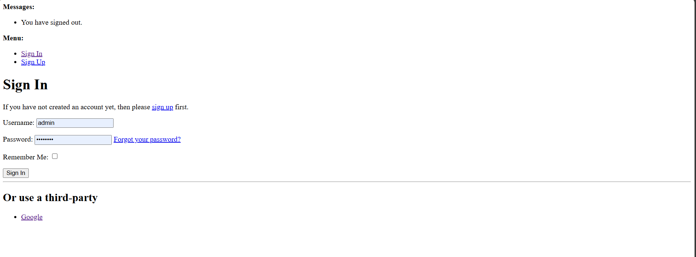
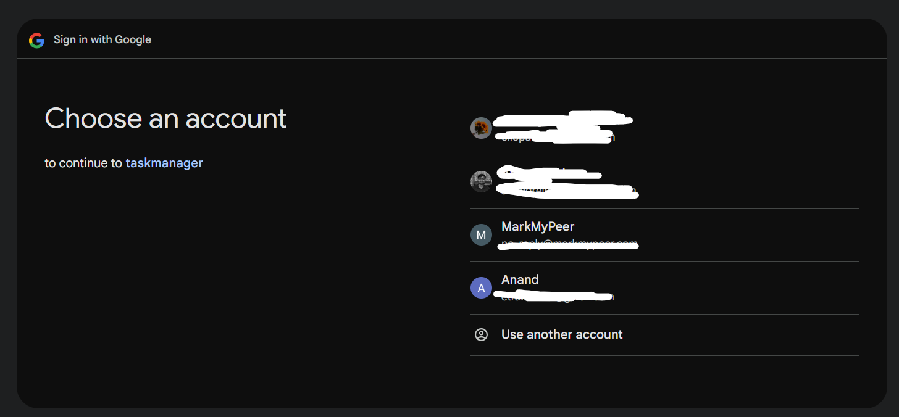
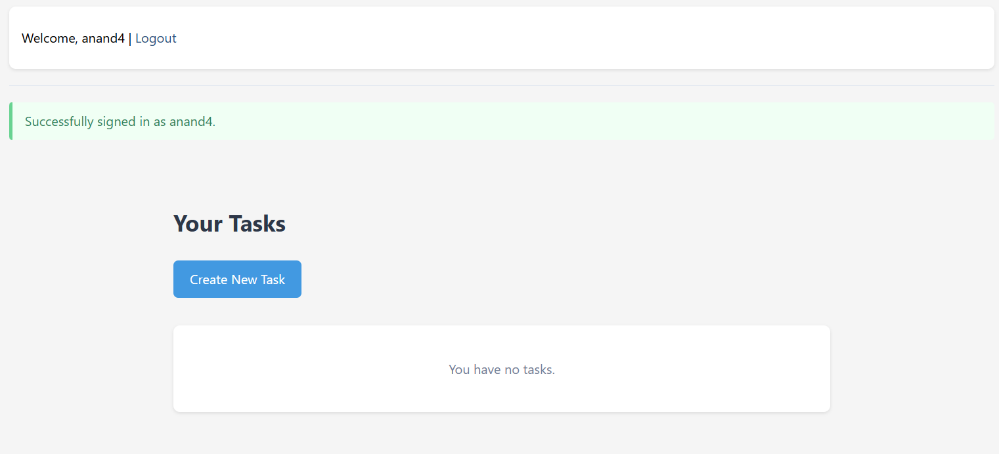
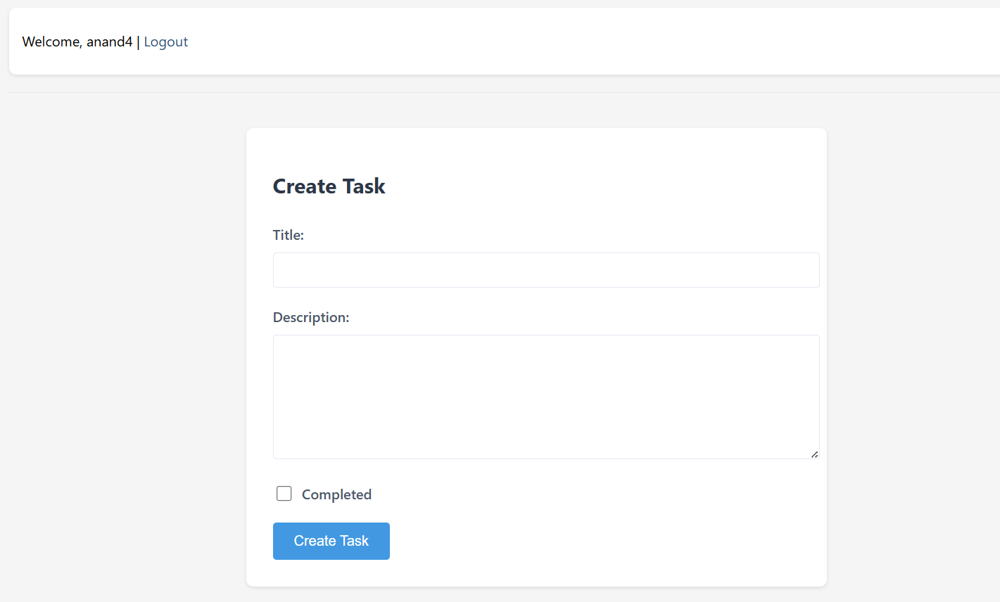
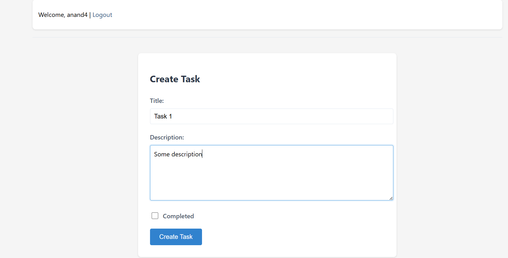
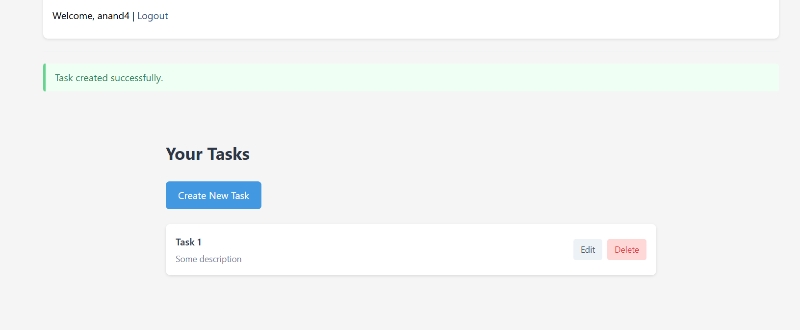
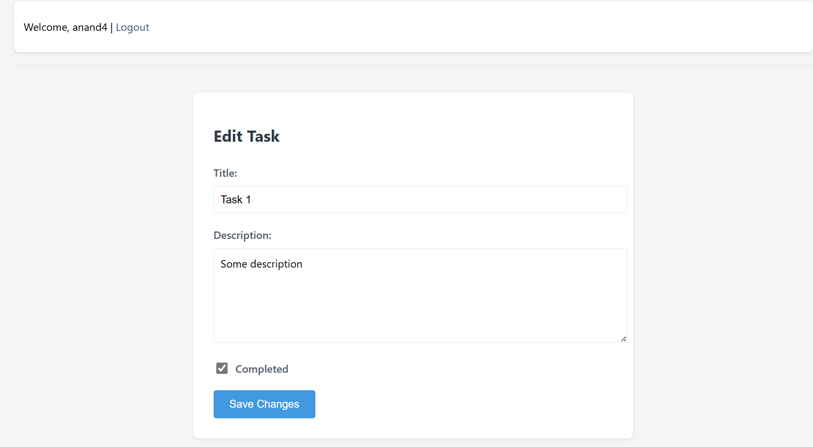
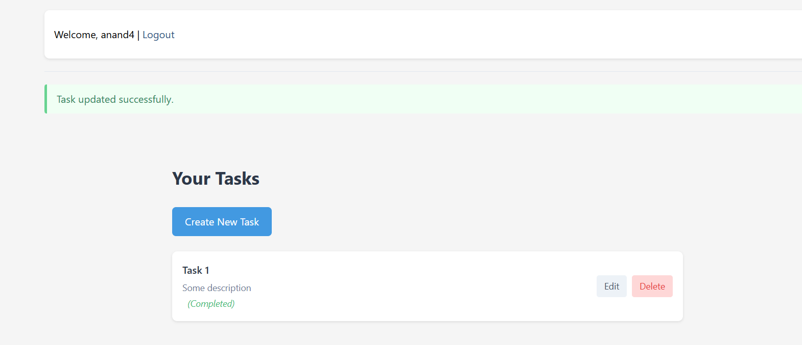
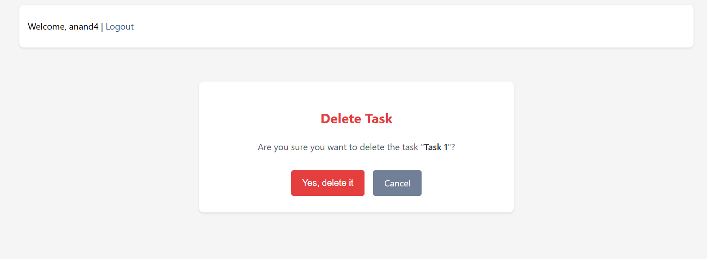
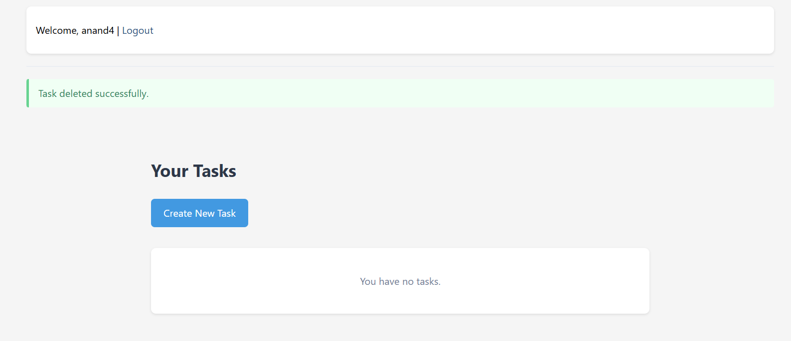
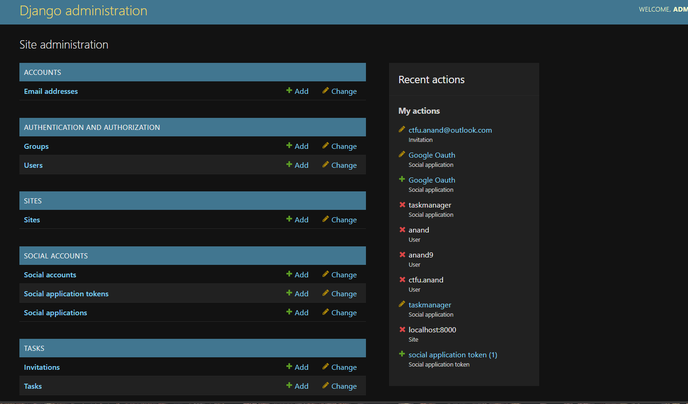
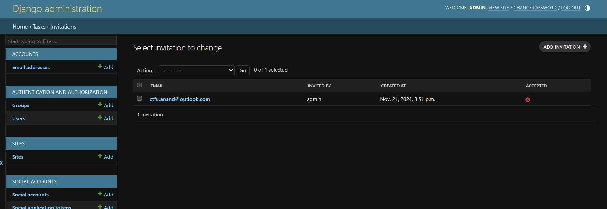
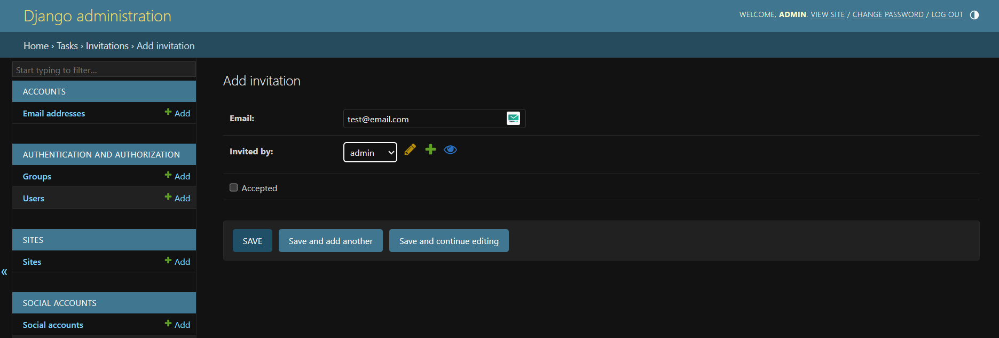
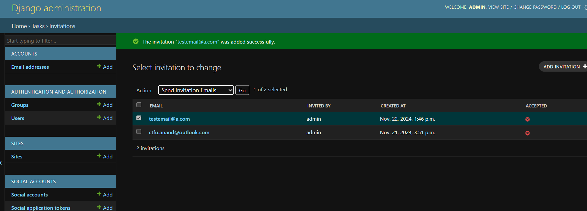
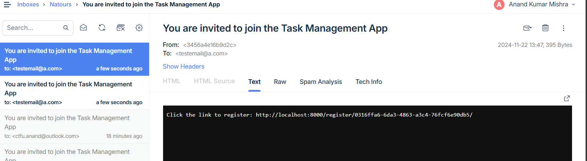
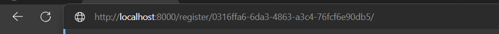
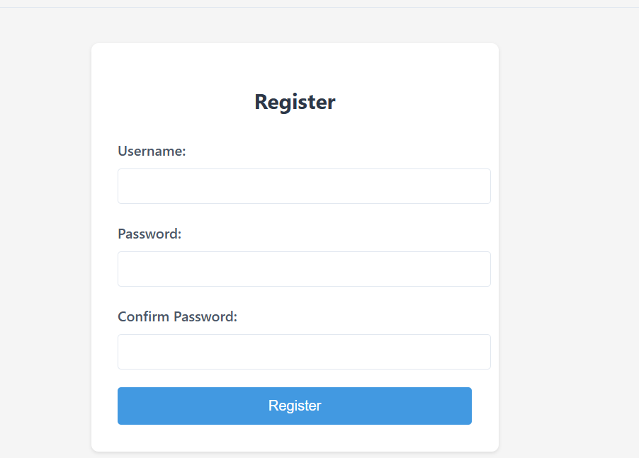
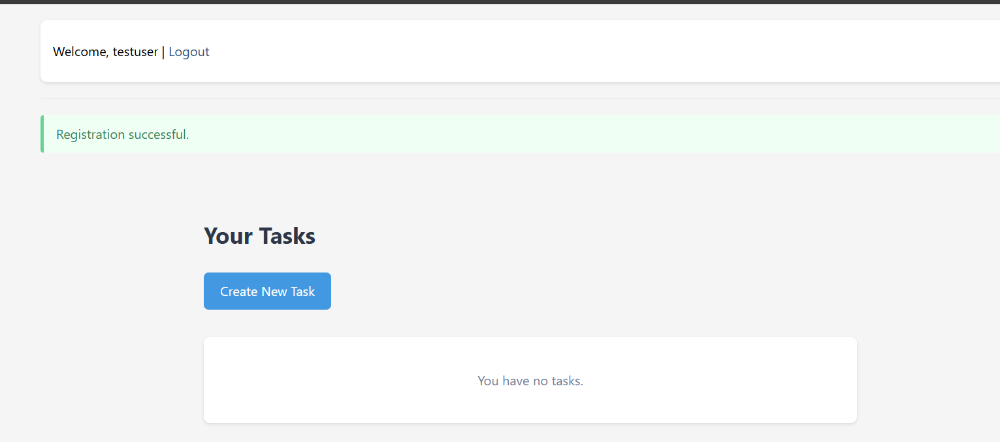
